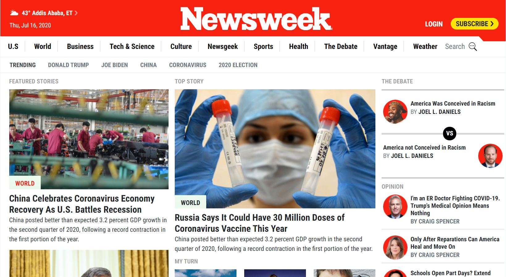

# Responsive Design Using Bootstrap CSS Framework
The purpose of this project is to recreate the webpage https://www.newsweek.com/ using Bootstrap by giving emphasis on responsiveness.

This project is Milestone 7 of the HTML/CSS curriculum under Microverse. 

## Built With

- HTML5, CSS3
- BootStrap 4

## Live Demo

[Live Demo Link](https://rawcdn.githack.com/Berabjesus/Newsweek.com-clone/950e01b17f4f8043e59c8084c75d023b73d8d15a/index.html)
## Authors

👤 **Bereket Beshane**

- Github: [@berabjesus](https://github.com/Berabjesus)
- Twitter: [@bereket_ababu_b](https://twitter.com/bereket_ababu_b)
- Linkedin: [linkedin](https://www.linkedin.com/in/bereket-beshane-a1b75a1a9/)

## 🤝 Contributing

Contributions, issues, any kind of feedback and feature requests are welcome!

## Show your support

Give a ⭐️ if you like this project!

## Acknowledgments

- On this website we worked on giving backgrounds to containers.

## 📝 License

This project has no license
